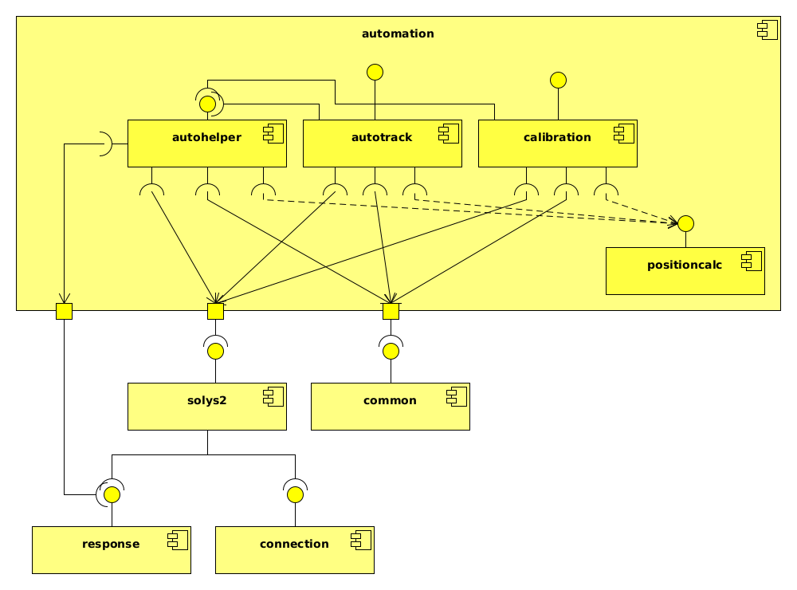

# solys2


[](https://www.gnu.org/licenses/gpl-3.0)

Python package for connecting and communicating with the Solys 2 via TCP/IP
and setting it up to automatically track the moon or the sun.

## Notice of Non-Affiliation and Disclaimer

We are not affiliated, associated, authorized, endorsed by, or in any way officially
connected with the SOLYS2 or with Kipp & Zonen, or any of its subsidiaries, or its
affiliates.

The official Kipp & Zonen website can be found at [kippzonen.com](https://kippzonen.com).

The names SOLYS2 and Kipp & Zonen as well as related names, marks, emblems and images are
registered trademarks of their respective owners.

## About

This software was initially developed by GOA-UVa (the Atmospheric Optics Group of Valladolid
University) for a campaign at the Izaña Atmospheric Observatory.

## Requirements

- python>=3.7
- numpy>=1.21.5
- pylunar>=0.6.0
- pysolar>=0.10
- ephem>=4.1.3
- spicedmoon>=0.1.3
- spicedsun>=0.0.2

## Installation

```sh
pip install solys2
```

## Usage

### Direct communication

```python
from solys2 import solys2

# Connect with the Solys2
solys = solys2.Solys2(ip, port, password)

# Tell the Solys2 to point at azimuth 30.
solys.set_azimuth(30)

# Get the current position at which the solys is pointing.
az, ze, _ = solys.get_current_position()

# Send the command "HO" to the Solys2
output = solys.send_command("HO")
# Another option would have been calling solys.home()
```

### Automatic tracking

```python
from solys2.automation import autotrack

# Track the sun, sending a new position each 15 seconds, and logging the
# information (movements, etc) to a file called "solys.log"
st = autotrack.SunTracker(ip, 15, port, password, True, "solys.log")

# Start tracking
st.start()

# Stop tracking the Sun
st.stop()
```

## Structure

The package is composed of different modules:
- **connection**: Module that encapsulates and abstracts functions that allow the low-level communication
with the Solys2.
- **response**: Module that contains functionalities for processing the Solys2 responses.
- **solys2**: Module that encapsulates and abstracts an interface for interacting with the Solys2.
- **positioncalc**: Module that contains the objects that allow the calculation of the position of the moon
and the sun using different libraries, like ephem, pysolar or SPICE (spicedmoon and spicedsun).
- **common**: Module containing common constants, functions and datatypes.
- **autohelper**: Module that contains the functionalities that are used for performing automatic actions
with the Solys2.
- **autotrack**: Module that contains the functionalities of performing automatic actions with the Solys2.
- **calibration**: This module contains the functionalities related to different calibration methods,
most of them used by the GOA-UVa.

The main modules that can be used are the module **solys2**, which allowes the user to interact
with the SOLYS2 easily, and **autotrack** and **calibration**, which let the user perform automated
functions like tracking the moon or performing a calibration cross over the moon.



## Libraries

In the automation module the user can choose which library to use in the calculations of the selected
body's data.

These libraries are the following:

For the Sun:
- **spicedsun**: Library that uses NASA's data. The most exact one, but requires the presence of kernels files.
- **pysolar**: Library that is very close to the correct data from SPICE, and doesn't require the presence of extra
files. This is the default one. The errors are related to the sunrise and sunset.
- **ephem**: Library that is also close to the correct data from SPICE, but not as much as pysolar. The errors
are related to the sunrise and sunset.


For the Moon:
- **spicedmoon**: Library that uses NASA's data. The most exact one, but requires the presence of kernels files.
- **ephem**: Library that is very close to the correct data from SPICE, and doesn't require the presence of extra
files. This is the default one, although the error might be too big for some users.
- **pylunar**: Library that is very incorrect for some punctual data. Usage not recommended.

### SPICE

SPICE is a toolkit created by the NASA's team NAIF, which contains a lot of functionalities that
help in the calculations of spatial data. The SPICE toolkit has been used in two
python libraries for the calculation of solar and lunar data: spicedsun and spicedmoon
respectively.

In order to use the SPICE libraries, a directory with all the kernels must be specified.

That directory must contain the following kernels:
- [https://naif.jpl.nasa.gov/pub/naif/JUNO/kernels/spk/de421.bsp](https://naif.jpl.nasa.gov/pub/naif/JUNO/kernels/spk/de421.bsp)
- [https://naif.jpl.nasa.gov/pub/naif/pds/wgc/kernels/pck/earth_070425_370426_predict.bpc](https://naif.jpl.nasa.gov/pub/naif/pds/wgc/kernels/pck/earth_070425_370426_predict.bpc)
- [https://naif.jpl.nasa.gov/pub/naif/generic_kernels/fk/planets/earth_assoc_itrf93.tf](https://naif.jpl.nasa.gov/pub/naif/generic_kernels/fk/planets/earth_assoc_itrf93.tf)
- [https://naif.jpl.nasa.gov/pub/naif/generic_kernels/pck/earth_latest_high_prec.bpc](https://naif.jpl.nasa.gov/pub/naif/generic_kernels/pck/earth_latest_high_prec.bpc)
- [https://naif.jpl.nasa.gov/pub/naif/generic_kernels/fk/satellites/moon_080317.tf](https://naif.jpl.nasa.gov/pub/naif/generic_kernels/fk/satellites/moon_080317.tf)
- [https://naif.jpl.nasa.gov/pub/naif/generic_kernels/pck/moon_pa_de421_1900-2050.bpc](https://naif.jpl.nasa.gov/pub/naif/generic_kernels/pck/moon_pa_de421_1900-2050.bpc)
- [https://naif.jpl.nasa.gov/pub/naif/generic_kernels/lsk/naif0011.tls](https://naif.jpl.nasa.gov/pub/naif/generic_kernels/lsk/naif0011.tls)
- [https://naif.jpl.nasa.gov/pub/naif/generic_kernels/pck/pck00010.tpc](https://naif.jpl.nasa.gov/pub/naif/generic_kernels/pck/pck00010.tpc)
